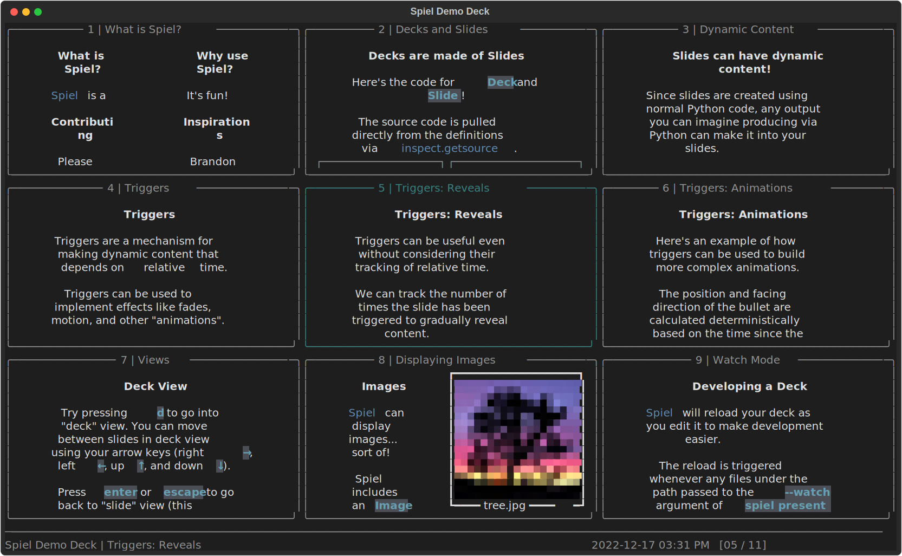

# Spiel

[](https://pypi.org/project/spiel/)
[](https://spiel.readthedocs.io/en/latest/?badge=latest)
[](https://pypi.org/project/spiel/)

[](https://results.pre-commit.ci/latest/github/JoshKarpel/spiel/main)
[](https://codecov.io/gh/JoshKarpel/spiel)
[](https://github.com/psf/black)

[](https://github.com/JoshKarpel/spiel/issues)
[](https://github.com/JoshKarpel/spiel/pulls)

Spiel is a framework for building and presenting richly-styled presentations in your terminal using Python.

To see what Spiel can do without installing it, you can view the demonstration deck in a container:
```bash
$ docker run -it --rm ghcr.io/joshkarpel/spiel
```
Alternatively, install Spiel (`pip install spiel`) and run this command to view the demonstration deck:
```bash
$ spiel demo present
```




## Sandboxed Execution via Containers

Spiel presentations are live Python code: they can do anything that Python can do.
You may want to run untrusted presentations (or even your own presentations) inside a container (but remember, even containers are not perfectly safe!).
We produce a [container image](https://github.com/users/JoshKarpel/packages/container/package/spiel)
that can be run by (for example) Docker.

Presentations without extra Python dependencies might just need to be bind-mounted into the container.
For example, if your demo file is at `$PWD/presentation/deck.py`, you could do
```bash
$ docker run -it --rm --mount type=bind,source=$PWD/presentation,target=/presentation ghcr.io/joshkarpel/spiel spiel present /presentation/deck.py
```

If the presentation has extra dependencies (like other Python packages),
we recommend building a new image that inherits our image (e.g., `FROM ghcr.io/joshkarpel/spiel:vX.Y.Z`).
Spiel's image itself inherits from the [Python base image](https://hub.docker.com/_/python).
