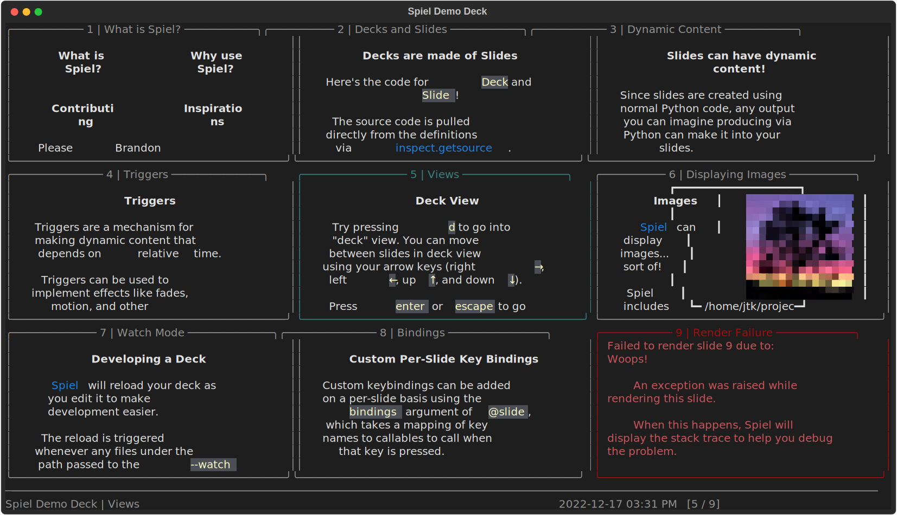
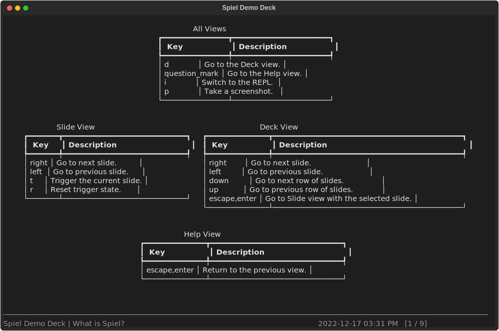

# Spiel

[Spiel](https://dictionary.cambridge.org/us/dictionary/english/spiel)
is a framework for building and presenting
[richly-styled](https://github.com/Textualize/rich) presentations in your terminal using Python.

