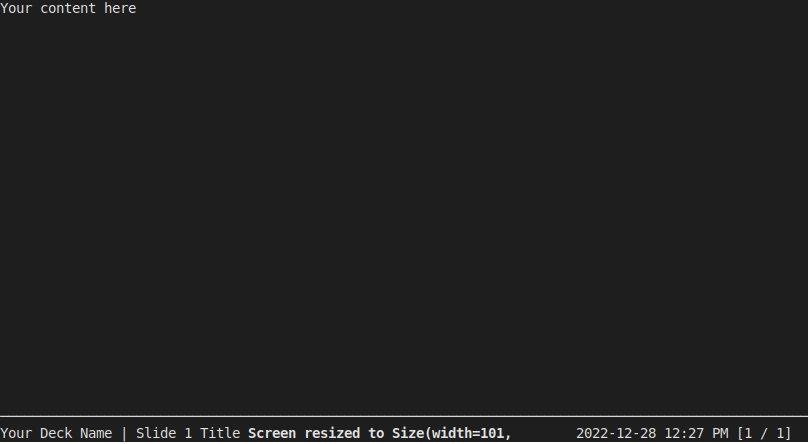
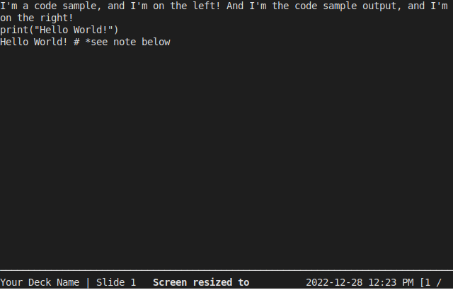

# Quick Start:

The most basic Spiel presentation looks like this:

```python
from spiel import Deck, present

deck = Deck(name="Your Deck Name")

@deck.slide(title="Slide 1 Title")
def slide1():
    content = """\
Your content here
    """
    return content

if __name__ == "__main__":
    present(__file__)
```

And when you run the Python file:


To recap, you first create a Deck object that has the name of your presentation. Then you create slide functions, add content into a triple-quoted string (aka a multiline string) and return it, and add the slide to the Deck with the `@deck.slide()` decorator. Finally, you call `present()` to generate the presentation.

You can make your slides a lot prettier, of course. Spiel renders its slides using Rich, so you can bring in Rich functionality to spruce up your slides. For instance, to set up a slide with a left side and right side (as a code demonstration, maybe), let's bring in some Rich features:

``` python
from rich.console import RenderableType
from rich.layout import Layout
```

And now let's use those in our slide:

```python
@deck.slide(title="Slide 1 Title")
def slide1() -> RenderableType:
    left_side = f"""\
I'm a code sample, and I'm on the left!

print("Hello World!")
        """

    right_side = f"""\
And I'm the code sample output, and I'm on the right!

Hello World! # *see note below
        """

    root = Layout()

    root.split_row(
        Layout(left_side),
        Layout(right_side),
    )

    return root
```

And when you run the Python file:



*Note: There are ways to execute code and get the output in your string, but those are beyond the scope of this guide. Check out [this Stack Overflow post](https://stackoverflow.com/questions/3906232/python-get-the-print-output-in-an-exec-statement) as a starting point if you are curious.

You'll likely want to have some way to better handle padding and sytax highlighting. The demo slides have some great starting points for that!

Adding more slides is as easy as adding more functions with the `@deck.slide()` decorator. The order of the functions in your file is the order in which they appear in your presentation.

Check out the source code of the [demo](https://github.com/JoshKarpel/spiel/blob/main/spiel/demo/demo.py) for more inspiration on ways to use Rich to make your slides beautiful!