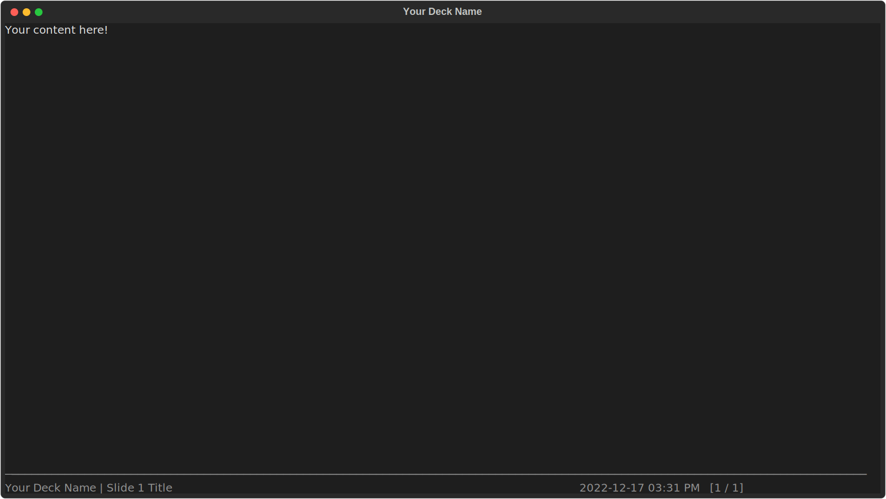
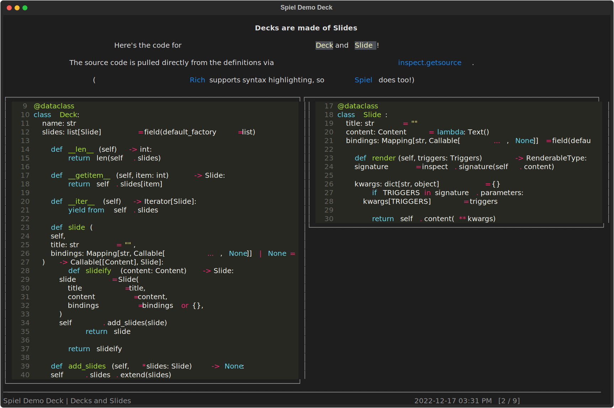

# Quick Start

## The Most Basic Deck

After installing Spiel (`pip install spiel`),
create a file called `deck.py` and copy this code into it:

```python
from spiel import Deck, present

deck = Deck(name="Your Deck Name")  #


@deck.slide(title="Slide 1 Title")
def slide_1():
    return "Your content here!"


if __name__ == "__main__":
    present(__file__)
```

That is the most basic Spiel presentation you can make.
To present the deck, run `python deck.py`.
You should see:



In the example above, you first create a `Deck` and provide the name of your presentation.
Then you create slides by decorating functions with `@deck.slide()`, providing the title of the slide.
The slide function can return anything that
[Rich can render](https://rich.readthedocs.io/en/stable/console.html#printing);
that return value will be displayed as the slide's content when you present it.
The order of the `@deck.slide()`-decorated functions in your file is the order in which they will appear in your presentation.

Running `python deck.py` started the presentation because of the call to `present()` in the
[`if __name__ == "__main__"` block](https://stackoverflow.com/questions/419163/what-does-if-name-main-do).

To see available keybindings for doing things like moving between slides,
press `?` to open the help view, which should look like this:


## Making Richer Slides

You can make your slides a lot prettier, of course.
As mentioned above, Spiel renders its slides using Rich, so you can bring in Rich functionality to spruce up your slides.
Let's explore some advanced features by recreating one of the slides from the demo deck.
Update your `deck.py` file with these imports and utility definitions:

``` python
import inspect
from textwrap import dedent

from rich.box import SQUARE
from rich.console import RenderableType
from rich.layout import Layout
from rich.markdown import Markdown
from rich.padding import Padding
from rich.panel import Panel
from rich.style import Style
from rich.syntax import Syntax

from spiel import Deck, Slide, present
from spiel.deck import Deck


SPIEL = "[Spiel](https://github.com/JoshKarpel/spiel)"
RICH = "[Rich](https://rich.readthedocs.io/)"

def pad_markdown(markup: str) -> RenderableType:
    return Padding(Markdown(dedent(markup), justify="center"), pad=(0, 5))
```

And then paste this code in to your `deck.py` file below your first slide:

```python
@deck.slide(title="Decks and Slides")
def code() -> RenderableType:
    markup = f"""\
        ## Decks are made of Slides

        Here's the code for `Deck` and `Slide`!

        The source code is pulled directly from the definitions via [inspect.getsource](https://docs.python.org/3/library/inspect.html#inspect.getsource).

        ({RICH} supports syntax highlighting, so {SPIEL} does too!)
        """
    root = Layout()
    upper = Layout(pad_markdown(markup), size=len(markup.split("\n")) + 1)
    lower = Layout()
    root.split_column(upper, lower)

    def make_code_panel(obj: type) -> RenderableType:
        lines, line_number = inspect.getsourcelines(obj)
        return Panel(
            Syntax(
                "".join(lines),
                lexer="python",
                line_numbers=True,
                start_line=line_number,
            ),
            box=SQUARE,
            border_style=Style(dim=True),
            height=len(lines) + 2,
        )

    lower.split_row(
        Layout(make_code_panel(Deck)),
        Layout(make_code_panel(Slide)),
    )

    return root
```

We start out by creating our text content and setting up some `Layout`s, which will let us divide the slide space into chunks.
Then, we create the `make_code_panel` function to take some lines of code from the `Deck` and `Slide` classes
and put them in a syntax-highlighted `Panel` (with some additional fancy Rich styling).
Finally, we add the code panels to our layout side-by-side and return `root`, the top-level `Layout`, from the function.

Run `python deck.py` again and go to the second slide (press `?` if you're not sure how to navigate!):



Check out the source code of the [demo deck](https://github.com/JoshKarpel/spiel/blob/main/spiel/demo/demo.py)
for more inspiration on ways to use Rich to make your slides beautiful!
Spiel provides a `spiel` CLI tool to make this easy:

- Present the demo deck in your terminal by running `spiel demo present`.
- View the source in your terminal with `spiel demo source`.
- Copy it to use as a starting point with `spiel demo copy <destination>`.
