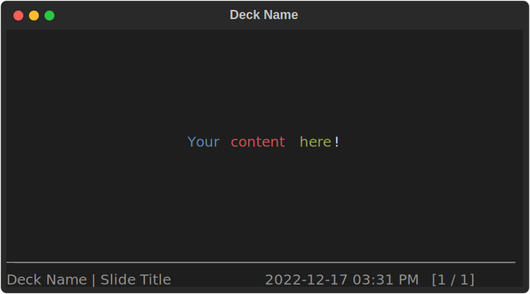
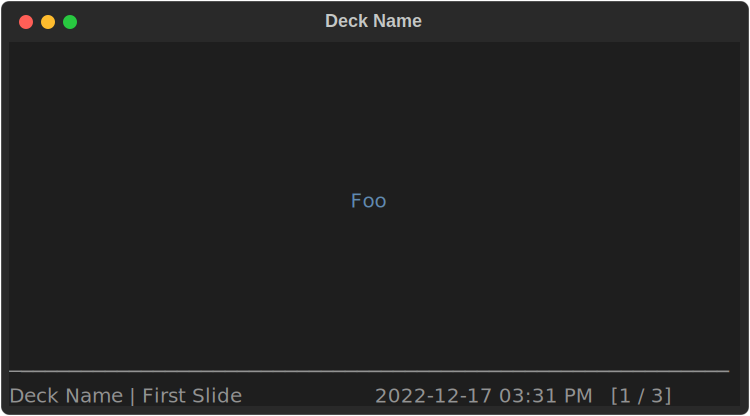
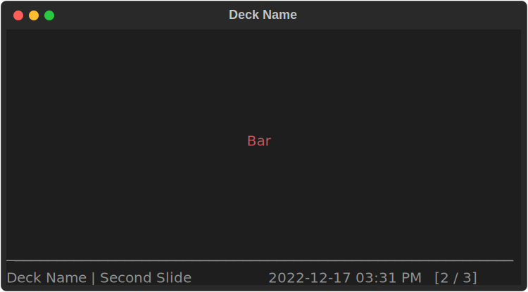
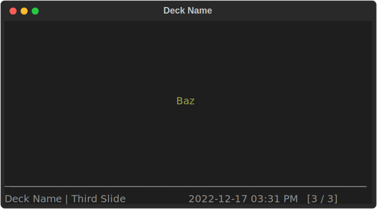
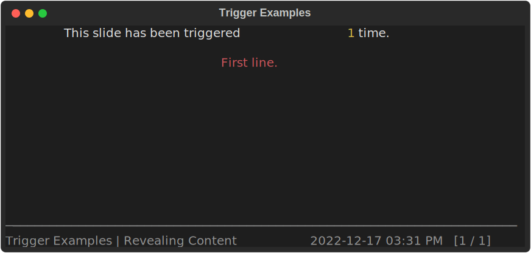
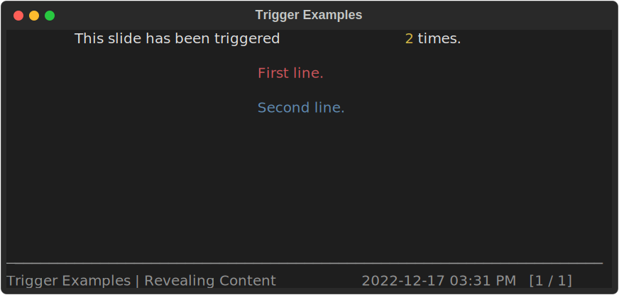
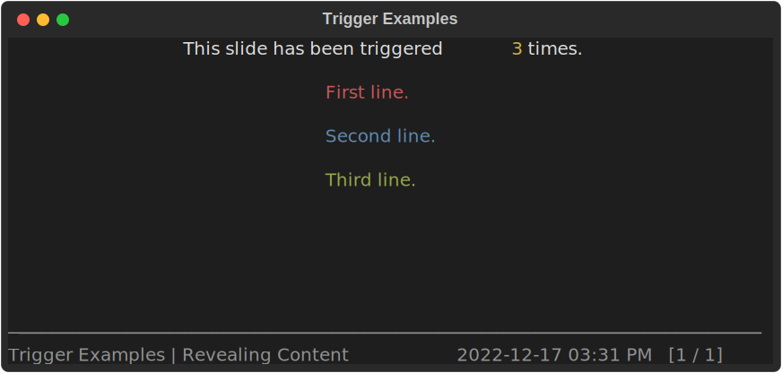
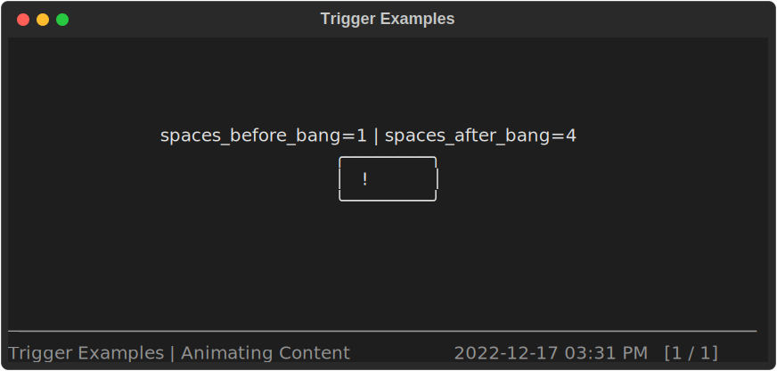
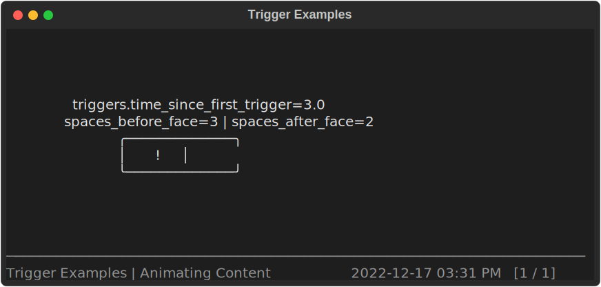
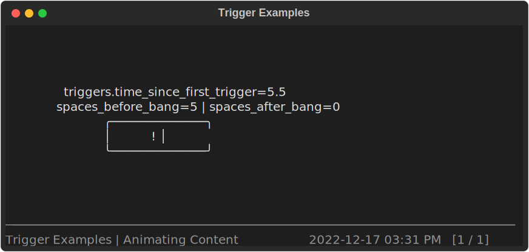

# Making Slides

## Slide Content Functions

Each slide's content is rendered by calling a "content function" that returns a
[Rich `RenderableType`](https://rich.readthedocs.io/en/stable/console.html#printing).

There are two primary ways to define these content functions.
For unique slides you can use the [`Deck.slide`][spiel.Deck.slide] decorator:

```python
--8<-- "examples/slide_via_decorator.py"
```


You might also find yourself wanting to create a set of slides programmatically
(well, even more programmatically).
You can use the [`Deck.add_slides`][spiel.Deck.add_slides] function to add
[`Slide`s][spiel.Slide] that you've created manually to your deck.

```python
--8<-- "examples/slide_loop.py"
```





This pattern is useful when you have a generic "slide template"
that you want to feed multiple values into without copying a lot of code.
You have the full power of Python to define your slides,
so you can use as much (or as little) abstraction as you want.

!!! tip "Slides are added to the deck in execution order"

    The slide order in the presentation is determined by the order
    that the `Deck.slide` decorator and `Deck.add_slides` functions are used.
    The two methods can be freely mixed;
    just make sure to call them in the order you want the slides to
    be presented in.

## When and how often are slide content functions called?

The slide content function is called for a wide variety of reasons
and it is not generally possible to predict how many times or exactly when
it will be called due a mix of time-interval-based and on-demand needs.

Here are some examples of when the content function will be called:

- When you move to the slide in Slide view.
- Sixty times per second while the slide is active in Slide view (see [Triggers](#triggers) below).
- When you switch to Deck view.
- The active slide's content function will be called if the deck is reloaded.

!!! tip

    Because of how many times they will be called,
    your content functions should be *fast* and *stateless*.

    If your content function needs state,
    it should store and use it via the [Fixtures](#fixtures) discussed below.

## Fixtures

The slide content function can take extra
[keyword arguments](https://docs.python.org/3/glossary.html#term-argument)
that provide additional information for advanced rendering techniques.

To have Spiel pass your content function one of these fixtures,
include a keyword argument with the corresponding fixture name in your content function's signature.

### Triggers

- Keyword: `triggers`
- Type: [`Triggers`][spiel.Triggers]

The `triggers` fixture is useful for making slides whose content depends either on
relative time (e.g., time since the slide started being displayed)
or where the content should change when the user "triggers" it
(similar to how a PowerPoint animation can be configured to run
[`On Click`](https://support.microsoft.com/en-us/office/animate-text-or-objects-305a1c94-83b1-4778-8df5-fcf7a9b7b7c6)).

To *trigger* a slide, press `t` in Slide view while displaying it.
Additionally, each slide is automatically triggered once when it starts being
displayed so that properties like
[`Triggers.time_since_last_trigger`][spiel.Triggers.time_since_last_trigger]
will always have usable values.

The `Triggers` object in any given call of the content function behaves like an immutable sequence of floats,
which represent relative times (in seconds) at which the slide has been triggered.
These relative times are comparable to each other, but are not comparable
to values generated by e.g. [`time.time`][time.time].
Over multiple calls of the content function,
the sequence of relative times is append-only:
any trigger time that has been added to the sequence will stay there until the

[`Triggers.now`][spiel.Triggers.now] is also available,
representing the relative time that the slide is being rendered at.

Triggers are reset when changing slides:
if you trigger a slide,
go to another slide,
then back to the initial slide,
the `triggers` from the first "instance"
of showing the slide *not* be remembered.

!!! info "`Trigger.now` resolution"

    Your slide content function will be called every sixtieth of a second,
    so the best time resolution you can get is about 16 milliseconds between
    renders, and therefore between `Trigger.now` values.

#### Revealing Content using Triggers

A simple use case for `triggers` is to gradually reveal content.
We won't even use the "relative time" component for this:
we'll just track how many times the slide has been triggered.

```python
--8<-- "examples/triggers_reveal.py"
```

When first displayed, the slide will look like this:



Note that the slide has already been triggered once,
even though we haven't pressed `t` yet!
As mentioned above, each slide is automatically triggered once
when it starts being displayed.

After pressing `t` to trigger the slide (really the second trigger):



And after pressing `t` again (really the third trigger):



#### Animating Content using Triggers

Let's build a simple animation that is driven by the time since the slide
started being displayed:

```python
--8<-- "examples/triggers_animation.py"
```

Here are some screenshots showing what the slide looks like at various times
after being displayed, with no additional key presses:





